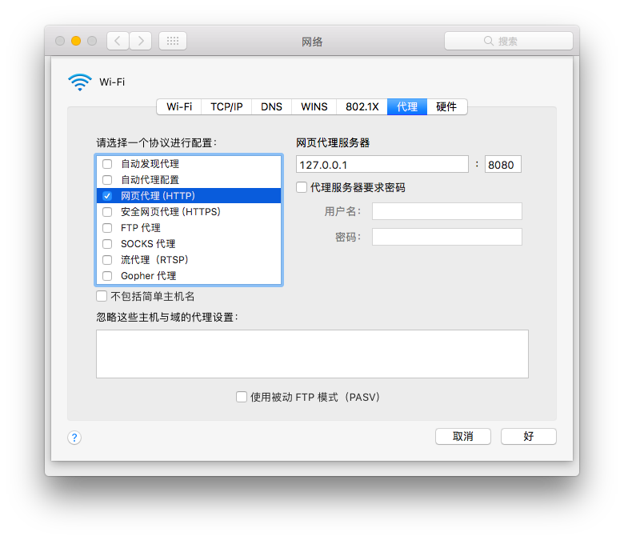

# Proxy lab


本文记录了一个基于`c socket`的简易代理服务器的实现。(`CS:APP lab 10 proxy lab`)

本代理服务器支持`keep-alive`连接，将访问记录保存在`log`文件。

全文分为以下部分

- HINT：`CS:APP`对服务器的要求


- Part1：迭代服务器实现 & 简易处理(强制`HTTP/1.0`)
- Part2：并行服务器 & 互斥量
- Part3：进一步理解`HTTP`协议，修改处理函数使其支持`keep-alive`
- Part4：`readn`与`writen`的优化
- Q&A ：出现的问题及解决方法


## HINT

- [x] Be careful about memory leaks. When the processing for an HTTP request fails for any reason, the thread must close all open socket descriptors and free all memory resources before terminating.
- [x] You will find it very useful to assign each thread a small unique integer ID (such as the current requestnumber) and then pass this ID as one of the arguments to the thread routine. If you display this ID ineach of your debugging output statements, then you can accurately track the activity of each thread.
- [x] To avoid a potentially fatal memory leak, your threads should run as detached, not joinable (CS:APP 13.3.6).
- [x] Since the log file is being written to by multiple threads, you must protect it with mutual exclusion semaphores wdfhenever you write to it (CS:APP 13.5.2 and 13.5.3).
- [x] Be very careful about calling thread-unsafe functions such as `inet` `ntoa`, `gethostbyname`, and `gethostbyaddr` inside a thread. In particular, the `open clientfd` function in csapp.c is thread-unsafe because it calls `gethostbyaddr`, a Class-3 thread unsafe function (CSAPP 13.7.1).You will need to write a thread-safe version of open `clientfd`, called `open_clientfd_ts`, that uses the lock-and-copy technique (CS:APP 13.7.1) when it calls `gethostbyaddr`.
- [x] Use the RIO (Robust I/O) package (CS:APP 11.4) for all I/O on sockets. Do not use standard I/O onsockets. You will quickly run into problems if you do. However, standard I/O calls such as fopenand fwrite are fine for I/O on the log file.
- [x] The `Rio_readn`, `Rio_readlineb`, and Rio writen error checking wrappers in `csapp.c` arenot appropriate for a realistic proxy because they terminate the process when they encounter an error. Instead, you should write new wrappers called `Rio readn w`, `Rio readlineb w`, and Rio writen w that simply return after printing a warning message when I/O fails. When either of the read wrappers detects an error, it should return 0, as though it encountered EOF on the socket.
- [x] Reads and writes can fail for a variety of reasons. The most common read failure is an `errno =ECONNRESET` error caused by reading from a connection that has already been closed by the peeron the other end, typically an overloaded end server. The most common write failure is an `errno =EPIPE` error caused by writing to a connection that has been closed by its peer on the other end. This can occur for example, when a user hits their browser’s Stop button during a long transfer.
- [x] Writing to connection that has been closed by the peer first time elicits an error with errno set to EPIPE. Writing to such a connection a second time elicits a `SIGPIPE` signal whose default action isto terminate the process. To keep your proxy from crashing you can use the SIGIGN argument to th esignal function (CS:APP 8.5.3) to explicitly ignore these SIGPIPE signals

## Part 1

Implementing a Sequential Web Proxy

## 简易`proxy lab`雏形

服务器框架

```c
int main(int argc, char **argv){
    int lisenfd, port;
    unsigned int clientlen;
    clientinfo* client;
    
  	
    /* Ignore SIGPIPE */
    Signal(SIGPIPE, SIG_IGN);
  
    if (argc != 2){
        fprintf(stderr, "usage:%s <port>\n", argv[0]);
        exit(1);
    }
    port = atoi(argv[1]);
    
    /* open log file */
    logfile = fopen("proxylog","w");
    
    lisenfd = Open_listenfd(port);
    clientlen = sizeof(struct sockaddr_in);
    
    while (1){
        /* Create a new memory area to pass arguments to doit */
        /* It will be free by doit */
        client = (clientinfo*)Malloc(sizeof(clientinfo));
        client->socketfd = Accept(lisenfd, (SA *)&client->clientaddr, &clientlen);
        printf("Client %s connected\n",inet_ntoa(client->clientaddr.sin_addr));
        doit(client);
        
        
    }
    return 0;
}
```

作为最初版本，先完成一个迭代服务器，而非并行服务器，这类服务器的框架相对简单，这个部分主要测试对于期功能的理解，并在只针对一个用户接入的情况下进行处理。

服务器框架可简化为如下，其中`doit()`为实际处理客户端请求的函数。

```c
init_server();
while(1){
  	accept();
  	doit();
}
```


## `doit()`处理客户端的请求

对于代理的处理条例很清晰

- 获取从客户发来的`HTTP`请求
- 拆解其中的`uri`
- 连接服务器，并重新发送`HTTP`请求
- 获取服务器的反馈并输出给客户端
- 记录该条访问记录

```c

/*
 *  doit
 */
void doit(clientinfo *client){
    int serverfd;
    char buf[MAXLINE],method[MAXLINE],uri[MAXLINE],version[MAXLINE];
    char hostname[MAXLINE],pathname[MAXLINE];
    int port;
    char errorstr[MAXLINE];
    char logstring[MAXLINE];
    rio_t rio;
    ssize_t len = 0;
    int resplen = 0;
    
    /* init args */
    Rio_readinitb(&rio,client->socketfd);
    Rio_readlineb(&rio,buf,MAXLINE);
    
    
    sscanf(buf,"%s %s %s",method,uri,version);
    
    if(strcmp(method,"GET")){
        fprintf(stderr, "error request\n");
        sprintf(errorstr,"%s Not Implement",method);
        clienterror(client->socketfd, method, "501","Not Implement", errorstr);
        Close(client->socketfd);
        return;
    }
    if(parse_uri(uri,hostname,pathname,&port)!=0){
        fprintf(stderr, "parse error\n");
        clienterror(client->socketfd, method, "400","uri error","URI error");
        Close(client->socketfd);
        return;
    }
#ifdef DEBUG
    printf("Finish parse %s %s %s %d\n",uri,hostname,pathname,port);
#endif
    
    /* connect to server */
    
    if((serverfd=open_clientfd(hostname,port))<0){
        printf("Cannot connect to server %s %d\n",hostname,port);
        clienterror(client->socketfd, method, "302","Server not found", "Server not found");
        Close(client->socketfd);
        return;
    }
    
    /* generate and push the request to server */
    if(pathname[0]=='\0') strcpy(pathname,"/");
    if(strcmp("HTTP/1.0",version)!=0) printf("Only support HTTP/1.0");
    sprintf(buf,"%s %s HTTP/1.0\r\n",method, pathname);
    Rio_writen(serverfd,buf,strlen(buf));
    sprintf(buf,"Host: %s\r\n",hostname);
    Rio_writen(serverfd,buf,strlen(buf));
    sprintf(buf,"\r\n");
    Rio_writen(serverfd,buf,strlen(buf));
    
    /* receive the response from server */
    Rio_readinitb(&rio, serverfd);
    while((len = rio_readnb(&rio, buf, MAXLINE)>0)){
        Rio_writen(client->socketfd, buf, MAXLINE);
        resplen += MAXLINE - len;
        memset(buf, 0, MAXLINE);
    }
    
    format_log_entry(logstring, &client->clientaddr, uri, resplen);
    fprintf(logfile, "%s\n", logstring);
    close(client->socketfd);
    close(serverfd);
    /* free the clientinfo space */
    free(client);
}

```

在这里遇到`Q&A`中的第二个问题，无法支持`HTTP/1.1`

尝试直接在设置中接入此`proxy`

而网页一般发出为`HTTP/1.1`，导致也存在卡在`read`的情况，需要特殊处理

## 另一种尝试

但是由于浏览器发出的变量中有要求`keep-alive`的，导致`read`不能用，还是放弃此种方法。

```c
/* Or just copy the HTTP request from client */
Rio_writen_w(serverfd, buf, strlen(buf));
while ((len = Rio_readlineb_w(&rio, buf, MAXLINE)) != 0) {
    Rio_writen_w(serverfd, buf,len);
    if (!strcmp(buf, "\r\n")) /* End of request */
        break;
    memset(buf,0,MAXLINE);
}
```


## `Parse_uri`的小BUG

```c
hostend = strpbrk(hostbegin, " :/\r\n\0");
/* when no ':' show up in the end,hostend may be NULL */
if(hostend == NULL) hostend = hostbegin + strlen(hostbegin);
```


## 简易代理测试

设置`http`代理



尝试连接


## Part 2

Dealing with multiple requests concurrently

​	

### 多线程

支持多线程是非常简单的，但是稍微复杂一点的是后面的互斥量处理。

这里先新写一个线程处理函数。

```c
void *thread_handler(void *arg){
    doit((clientinfo*)arg);
    return NULL;
}
```

然后在原来的`doit`的地方改为

```c
Pthread_create(&thread, NULL, thread_handler, client);
Pthread_detach(thread);
```

现在服务器的框架如下：

```c
main(){
  init_server();
  while(1){
      accept();
      create_newThread(handler,arg);
  }
}
//每个线程的处理
handler(arg){
  	initThread();
	doit(arg);
}
```


### 互斥量

由于在`macOS`中的`sem_init`已经被标记为`__deprecated`，内存中的互斥量已经不能用了。这里改为基于文件的`sem_open`来替代`sem_init`。

```c
/* Mutex semaphores */
sem_t *mutex_host, *mutex_file;

if((mutex_host = sem_open("mutex_host",O_CREAT,S_IRUSR | S_IWUSR, 1))==NULL){
    fprintf(stderr,"cannot create mutex");
}
if((mutex_file = sem_open("mutex_file",O_CREAT,S_IRUSR | S_IWUSR, 1))==NULL){
    fprintf(stderr,"cannot create mutex");
}
```

在文档中提到过`open_client`中由于调用了`getaddrbyhost`，必须要在调用之前获取互斥量，故完成新的`open_clientfd`。

在`CSAPP`中打包好了`PV`原语的接口，可以直接调用。

原来的`open_clientfd`的实现方法如下，只用在注视掉的地方加上`PV`原语保证只有一个`thread`在`cs`区域即可。

```c
	/* Fill in the server's IP address and port */
    bzero((char *) &serveraddr, sizeof(serveraddr));
    serveraddr.sin_family = AF_INET;
	//P(mutex_host);
    if ((hp = gethostbyname(hostname)) == NULL)
        return -2; /* check h_errno for cause of error */
    bcopy((char *)hp->h_addr_list[0],
          (char *)&serveraddr.sin_addr.s_addr, hp->h_length);
    serveraddr.sin_port = htons(port);
	//V(mutex_host);
```

对于文件，进行类似操作

```c
format_log_entry(logstring, &client->clientaddr, uri, resplen); 
P(mutex_file);
fprintf(logfile, "%s\n", logstring);
V(mutex_file);
```

为了能够在服务器运行的时候打开文件，将文件操作修改为如下：

```c
format_log_entry(logstring, &client->clientaddr, uri, resplen); 
P(mutex_file);
logfile = fopen("proxy.log","a");
fprintf(logfile, "%s\n", logstring);
fclose(logfile);
V(mutex_file);
```


### thread_id

利用一个全局变量来记录当前`thread`的`id`。并通过`clientinfo`将其传走。

```c
/* thread id */
unsigned long tid = 0;

printf("Client %s connected tid = %zd\n",inet_ntoa(client->clientaddr.sin_addr),tid);
client->tid = tid ++;
Pthread_create(&thread, NULL, thread_handler, client);
```


### `Rio_xxx_w`

由于`Rio_writen`与`Rio_readnb`遇到错误时会直接`unix_error`。为了保证服务器继续运行，需要将其改为打印错误并返回。

```c
void Rio_writen_w(int fd, void *usrbuf, size_t n){
    if (rio_writen(fd, usrbuf, n) != n)
        printf("Rio_writen_w error\n");
}

ssize_t Rio_readnb_w(rio_t *rp, void *usrbuf, size_t n){
    ssize_t rc;
    if ((rc = rio_readnb(rp, usrbuf, n)) < 0) {
        printf("Rio_readnb_w error\n");
        rc = 0;
    }
    return rc;
}

ssize_t Rio_readlineb_w(rio_t *rp, void *usrbuf, size_t maxlen){
    ssize_t rc;
    if ((rc = rio_readlineb(rp, usrbuf, maxlen)) < 0) {
        printf("Rio_readlineb_w failed\n");
        return 0;
    }
    return rc;
}
```


## Part3

### 解决`HTTP/1.1`以及图片加载问题

在解决之前，在`Github`上转了一圈，所看有限几个`repo`中有的绕过了这个部分，直接像上面一样直接解析发送`HTTP/1.0`的请求，有的直接无差别用`readline`导致图片等文件仍然陷入`read`导致必须等待对方服务器断开连接后才能读到完整数据从`read`中出来，而导致网页加载速度奇慢。

下面就从`HTTP`的协议入手，寻找一个妥善的方法解决该问题。

> 1. 当客户端请求时是`Connection: keep-alive`的时候，服务器返回的形式`Transfer-Encoding: chunked`的形式，以确保页面数据是否结束，长连接就是这种方式，用`chunked`形式就不能用`content-length`
>
>
> 2. `content-length`设置响应消息的实体内容的大小，单位为字节。对于HTTP协议来说，这个方法就是设置`Content-Length`响应头字段的值。
> 3. 因为当浏览器与WEB服务器之间使用持久(`keep-alive`)的HTTP连接，如果WEB服务器没有采用`chunked`传输编码方式，那么它必须在每一个应答中发送一个`Content-Length`的响应头来表示各个实体内容的长度，以便客户端能够分辨出上一个响应内容的结束位置。
> 4. 当不是`keep-alive`，就是常用短连接形式，会直接把连接关掉，不需要长度。
> 5. 服务器上取得是动态内容，所有没有`content-length`这项
> 6. 如果是静态页面，则有`content-length`

故，对于服务器传回来的信息，不能直接无脑读，要对头部进行解析。对于服务器传回来的信息进行处理的步骤如下：

- 读头，头里面有几个比较重要的信息
  - `\n\r`代表着头的结束。
  - `Content-Length:`条目代表着时明确给出长度的`case`，需要记录下长度的大小
  - `Transfer-Encoding:Chunked`条目代表着属于`Chunked`编码的`case`，在后面用`readline`进行处理。
- 读`body`
  - 若为`Chunked`编码，则直接使用`readline`进行读取。若读到`0/r/n`时，代表当前的`body`已经结束。退出循环。
  - 若有`content-length`属性，则利用`read_size = MAXLINE > content_length ?content_length : MAXLINE`计算每次需要读取的`byte`，然后调用`readnb`来精确读取字节。当读取到指定字节代表着`body`结束，退出循环。

这样可以解决`keep-alive`导致的问题。

```c
/* Receive response from target server and forward to client */
Rio_readinitb(&rio, serverfd);
/* Read head */
while ((len = Rio_readlineb_w(&rio, buf, MAXLINE)) != 0) {
    /* Fix bug of return value when response line exceeds MAXLINE */
    if (len == MAXLINE && buf[MAXLINE - 2] != '\n') --len;
    /* when found "\r\n" means head ends */
    if (!strcmp(buf, "\r\n")){
        Rio_writen_w(client->socketfd, buf, len);
        break;
    }
    if (!strncasecmp(buf, "Content-Length:", 15)) {
        sscanf(buf + 15, "%u", &content_length);
        chunked = False;
    }
    if (!strncasecmp(buf, "Transfer-Encoding:", sizeof("Transfer-Encoding:"))) {
        if(strstr(buf,"chunked")!=NULL || strstr(buf,"Chunked")!=NULL)
            chunked = True;
    }
    
    /* Send the response line to client and count the total len */
    Rio_writen_w(client->socketfd, buf, len);
    recv_len += len;
}

/* Read body */
if(chunked){
    /* Transfer-Encoding:chuncked */
    while ((len = Rio_readlineb_w(&rio, buf, MAXLINE)) != 0) {
        /* Fix bug of return value when response line exceeds MAXLINE */
        if (len == MAXLINE && buf[MAXLINE - 2] != '\n') --len;
        /* Send the response line to client and count the total len */
        Rio_writen_w(client->socketfd, buf, len);
        recv_len += len;
        /* End of response */
        if (!strcmp(buf, "0\r\n")) {
            Rio_writen_w(client->socketfd, "0\r\n", 2);
            recv_len += 2;
            break;
        }
    }
}
else{
    read_size = MAXLINE > content_length?content_length:MAXLINE;
    while((len = Rio_readnb_w(&rio,buf,read_size))!=0){
        content_length -= len;
        recv_len += len;
        Rio_writen_w(client->socketfd, buf, len);
        if(content_length == 0) break;
        read_size = MAXLINE > content_length?content_length:MAXLINE;
    }
}
```

当然这不是真正意义上的`keep-alive`。要做到持续链接少`TCP`建立几次，需要利用循环，再回到上面从客户端获取信息。


## Part4

再次回到`writen`与`readn`的函数上。但用户还没加载完内容，就开始点击进入下一个网页，导致关闭了当前的网页，就会导致`writen`出现错误。

> Reads and writes can fail for a variety of reasons. The most common read failure is an `errno =ECONNRESET` error caused by reading from a connection that has already been closed by the peeron the other end, typically an overloaded end server. 
>
> The most common write failure is an `errno =  EPIPE` error caused by writing to a connection that has been closed by its peer on the other end. This can occur for example, when a user hits their browser’s Stop button during a long transfer.

首先将这种错误情况单独处理

```c
int Rio_writen_w(int fd, void *usrbuf, size_t n){
    if (rio_writen(fd, usrbuf, n) != n){
        printf("Rio_writen_w error\n");
        if(errno == EPIPE)
            /* client have closed this connection */
            return CLIENT_CLOSED;
        return UNKOWN_ERROR;
    }
    return NO_ERROR;
}
```

然后将所有的`writen_w`替换为

```c
if(Rio_writen_w(client->socketfd, buf, len)==CLIENT_CLOSED){
  	clienton = False; 
  	break;
}
```

当`clienton`为`false`的情况就可以直接跳过剩余，直接到`log`

同样的，修改`read`为

```c
ssize_t Rio_readnb_w(rio_t *rp, void *usrbuf, size_t n,bool *serverstat){
    ssize_t rc;
    if ((rc = rio_readnb(rp, usrbuf, n)) < 0) {
        printf("Rio_readnb_w error\n");
        rc = 0;
        if(errno == ECONNRESET) *serverstat = False;
    }
    return rc;
}

ssize_t Rio_readlineb_w(rio_t *rp, void *usrbuf, size_t maxlen,bool *serverstat){
    ssize_t rc;
    if ((rc = rio_readlineb(rp, usrbuf, maxlen)) < 0) {
        printf("Rio_readlineb_w failed\n");
        rc = 0;
        if(errno == ECONNRESET) *serverstat = False;
    }
    return rc;
}
```

修改从客户端读取的`readline`为

```c
Rio_readlineb_w(&rio, buf, MAXLINE,&clienton)
```

修改从服务器读取的`readline`为

```c
Rio_readlineb_w(&rio, buf, MAXLINE,&serveron)
```

并添加一些对于`server`与`client`状态的检查避免消耗资源。


## Q&A

- 为何都适用`fd`来描述套接字

  > 从`unix`程序的角度来看，`socket`是一个有相应描述符的打开文件。

- 为何在`HTTP/1.1`的情况下，需要中断等很久才能够读出来

  ```
  Client 127.0.0.1 connected
  error request
  Client 127.0.0.1 connected
  Finish parse http://www.baidu.com www.baidu.com  80
  Interrupted and Rebegin
  Interrupted and Rebegin
  Interrupted and Rebegin
  Interrupted and Rebegin
  ```

  ```c
  while (nleft > 0) {
    	//在这一步出不来？？？？
      if ((nread = read(fd, bufp, nleft)) < 0) {
          if (errno == EINTR) /* interrupted by sig handler return */
              nread = 0;      /* and call read() again */
          else
              return -1;      /* errno set by read() */
      }
      else if (nread == 0)
          break;              /* EOF */
      nleft -= nread;
      bufp += nread;
  }
  ```

  观察是在`HTTP/1.1`的情况下，在`read`函数出不来。
  猜测可能是`1.1`是持续链接，不存在`EOF`，需要手动判断是否该退出`while`

  **已解决**，见`Part3`

- 非内存的`mutex`打开时会读到上次的值

  先利用`unlink`来取消链接。

  ```c
  sem_unlink("mutex_host");
  sem_unlink("mutex_file");
  if((mutex_host = sem_open("mutex_host",O_CREAT,S_IRUSR | S_IWUSR, 1))==NULL){
      fprintf(stderr,"cannot create mutex");
  }
  if((mutex_file = sem_open("mutex_file",O_CREAT,S_IRUSR | S_IWUSR, 1))==NULL){
      fprintf(stderr,"cannot create mutex");
  }
  ```

  ​